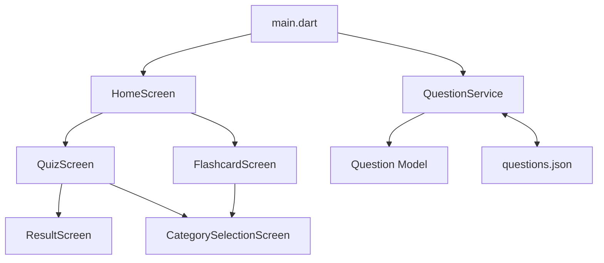
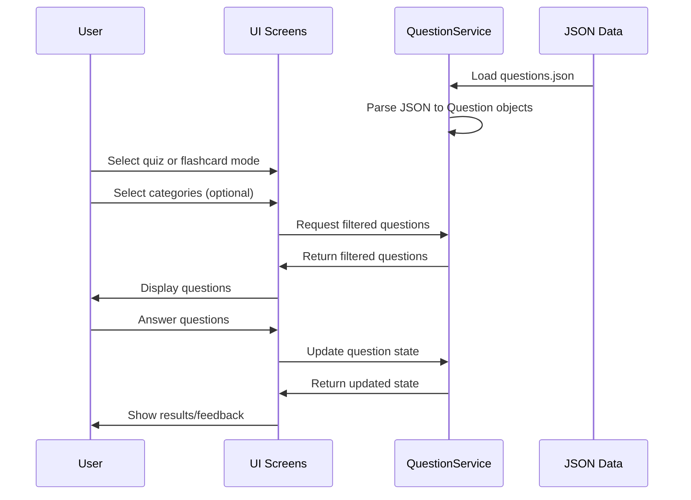

# Sistem Mimarisi ve Desenler

## Genel Mimari

ABD Vatandaşlık Testi Uygulaması, Flutter framework kullanılarak geliştirilmiş bir mobil uygulamadır. Uygulama, aşağıdaki temel mimari bileşenlerden oluşmaktadır:



## Temel Bileşenler

### 1. Veri Modelleri

- **Question**: Soru verilerini temsil eden model sınıfı. Her soru için ID, kategori, soru metni, cevap seçenekleri ve kullanıcı etkileşimi durumunu (cevaplanmış mı, doğru mu) içerir.
- **Option**: Her bir cevap seçeneğini temsil eden model sınıfı. Seçenek metni ve doğru olup olmadığı bilgisini içerir.

### 2. Servisler

- **QuestionService**: Soruların yüklenmesi, filtrelenmesi ve kullanıcı cevaplarının işlenmesinden sorumlu singleton servis. Uygulama genelinde tutarlı bir veri erişimi sağlar.

### 3. Ekranlar

- **HomeScreen**: Ana ekran, kullanıcının ilerleme durumunu gösterir ve diğer ekranlara erişim sağlar.
- **QuizScreen**: Quiz modunu uygular, soruları gösterir ve kullanıcının cevaplarını işler.
- **FlashcardScreen**: Flashcard modunu uygular, soru-cevap kartlarını gösterir.
- **CategorySelectionScreen**: Kullanıcının çalışmak istediği kategorileri seçmesini sağlar.
- **ResultScreen**: Quiz sonuçlarını gösterir.

### 4. Widget'lar

- **AnswerOption**: Cevap seçeneklerini görüntülemek için özel widget.
- **QuestionCard**: Soruları görüntülemek için özel widget.

## Tasarım Desenleri

### 1. Singleton Pattern

QuestionService, uygulama genelinde tek bir örnek olarak çalışır. Bu, tüm ekranların aynı veri kaynağını kullanmasını ve tutarlı bir kullanıcı deneyimi sağlar.

```dart
static final QuestionService _instance = QuestionService._internal();
  
factory QuestionService() {
  return _instance;
}
  
QuestionService._internal();
```

### 2. Factory Pattern

Question ve Option sınıfları, JSON verilerinden nesneler oluşturmak için factory constructor'lar kullanır.

```dart
factory Question.fromJson(Map<String, dynamic> json) {
  return Question(
    id: json['id'] as int,
    category: json['category'] as String,
    question: json['question'] as String,
    options: (json['options'] as List)
        .map((option) => Option.fromJson(option as Map<String, dynamic>))
        .toList(),
  );
}
```

### 3. Dependency Injection

Servisler, constructor injection yöntemiyle ekranlara aktarılır. Bu, bağımlılıkların açıkça belirtilmesini ve test edilebilirliği artırır.

```dart
class HomeScreen extends StatefulWidget {
  final QuestionService questionService;

  const HomeScreen({
    Key? key, 
    required this.questionService,
  }) : super(key: key);
  
  // ...
}
```

### 4. State Management

Uygulama, Flutter'ın yerleşik StatefulWidget mekanizmasını kullanarak durum yönetimini gerçekleştirir. Her ekran kendi durumunu yönetir ve gerektiğinde QuestionService aracılığıyla global duruma erişir.

## Veri Akışı



## Teknik Kararlar

1. **Flutter Kullanımı**: Cross-platform geliştirme için Flutter seçilmiştir, böylece tek bir kod tabanıyla hem Android hem de iOS platformları desteklenir.

2. **JSON Veri Depolama**: Sorular, uygulama içinde gömülü bir JSON dosyasında saklanır. Bu, internet bağlantısı olmadan da uygulamanın çalışmasını sağlar.

3. **Singleton Servis**: QuestionService, uygulama genelinde tutarlı veri erişimi sağlamak için singleton olarak tasarlanmıştır.

4. **Kategori Filtreleme**: Kullanıcıların belirli konulara odaklanabilmesi için kategori filtreleme özelliği eklenmiştir.

5. **Çoklu Öğrenme Modları**: Farklı öğrenme stillerine hitap etmek için quiz ve flashcard gibi farklı modlar sunulmuştur.

6. **İlerleme Takibi**: Kullanıcıların ilerlemesini takip etmek için soruların durumu (cevaplanmış, doğru/yanlış) saklanır.
